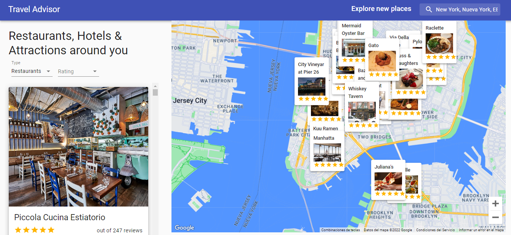

<h1 align="center">Travel Advisor</h1>

<!-- TABLE OF CONTENTS -->

## Table of Contents

- [Overview](#overview)
  - [Built With](#built-with)
- [Contact](#contact)

<!-- OVERVIEW -->

## Overview

### Where can I see your demo?

### What have you learned/improved?
Building this app was a great experience, I learned a lot about Material UI, for example how to use the built-in components, their icons, and hw to apply personal styles.
Also, it was awesome to use the react google map library, that allows you to add a lot of functionalities. Finally, by using RapidAPI travel advisor REST API I learned more about the good practices and concepts for fetching data and displaying it.

## Built With

- [React](https://reactjs.org/)
- [Material UI](https://mui.com/)
- [Google map react](https://www.npmjs.com/package/google-map-react)
- [Axios](https://axios-http.com/docs/intro)
- [RapidAPI-TravelAdvisor](https://rapidapi.com/apidojo/api/travel-advisor/)

## Contact

- Website [Felipe´s Portfolio](hhttps://felipeverger.netlify.app)
- GitHub [@felipeVerger](https://github.com/felipeVerger)
- Twitter [@felipe_verger](https://twitter.com/felipe_verger)
